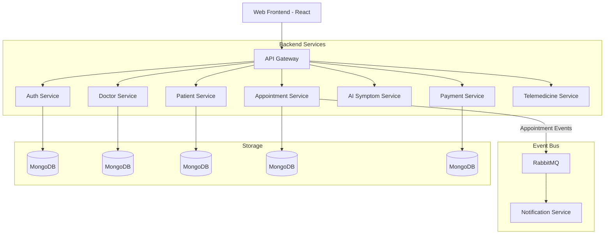

# 🏥 CareNet Healthcare Platform

[](https://microservices.io/)
[](https://reactjs.org/)
[](https://nodejs.org/)
[](https://www.docker.com/)

*CareNet* is a state-of-the-art, AI-enabled smart healthcare ecosystem. Designed with a modern microservices architecture, it provides a seamless experience for patients, doctors, and administrators to manage medical consultations, telemedicine sessions, and preliminary diagnoses.

---

## ✨ Key Features

### 🤖 AI-Powered Symptom Checker
Leverages advanced AI models (Gemini API) to analyze user-reported symptoms and provide preliminary healthcare guidance.

### 📅 Smart Appointment Management
Real-time scheduling system that allows patients to book slots based on doctor availability, with automatic conflict resolution.

### 🎥 Integrated Telemedicine
Built-in video consultation features powered by Jitsi/8x8, enabling remote healthcare services through a secure interface.

### 🛡️ Secure Auth & Verification
Role-based access control (RBAC) with JWT authentication. Includes a rigorous verification workflow for medical professionals to ensure trust.

### 💳 Modern Billing & Payments
Integrated payment gateway supporting secure transactions for consultations and services.

### 🔔 Event-Driven Notifications
Real-time alerts via Email and SMS powered by RabbitMQ, ensuring patients and doctors stay synchronized.

---

## 🏗️ System Architecture

The platform follows a distributed microservices pattern, ensuring high availability, scalability, and maintainability.




---

## 🛠️ Technology Stack

| Category | Technology / Libraries |
| :--- | :--- |
| *Frontend* | React.js (18+), Vite, Tailwind CSS, Framer Motion, lucide-react |
| *Backend* | Node.js (18+), Express.js, axios, helmet, cors, express-rate-limit |
| *Auth & Security* | JWT (jsonwebtoken), bcryptjs, express-validator, multer (file uploads) |
| *Database* | MongoDB (Mongoose ODM), optional Supabase connectors for analytics/storage |
| *Messaging & Events* | RabbitMQ (amqplib), event-driven webhooks, in-app notifications |
| *Payments* | PayHere (webhook integration), PDF invoice generation (pdfkit or similar) |
| *AI / ML* | Google Gemini (via service wrapper), local rate-limiting + emergency keyword filter |
| *Realtime / Telemedicine* | Jitsi / WebRTC integration (telemedicine service), WebSocket-friendly design |
| *Infrastructure* | Docker, Docker Compose, Kubernetes (k8s), Minikube, GitHub Actions (recommended CI) |
| *API Gateway & Proxy* | Express Gateway / custom gateway patterns |

Note: Specific package versions are declared in each service's `package.json` file. Use those for exact dependency management.

---

## 📂 Microservices Overview

| Service | Responsibility |
| :--- | :--- |
| *Auth Service* | Identity management, JWT issuing, and profile access control. |
| *Doctor Service* | Doctor onboarding, profile management, and verification status. |
| *Patient Service* | Patient profile management and health record storage. |
| *Appointment Service* | Core business logic for scheduling, slots, and bookings. |
| *AI Symptom Service* | Analysis of symptoms using Large Language Models. |
| *Notification Service* | Sending Email/SMS alerts triggered by system events. |
| *Payment Service* | Processing and tracking financial transactions. |
| *Telemedicine Service* | Virtual room management and session tokens. |

---

## 🔌 API Endpoints (by service)
Below are the primary HTTP API endpoints exposed by each microservice (base paths shown). Use the API Gateway or service base URLs when testing locally.

- Auth Service (`/api/auth`)
    - POST `/register` — register user (multipart: `profileImage`)
    - POST `/login` — login (returns JWT)
    - GET `/me` — get authenticated user profile
    - PUT `/me` — update profile
    - POST `/me/avatar` — upload avatar (multipart)
    - POST `/verify-email`, `/verify-phone`, `/resend-otp`, `/forgot-password`, `/reset-password`
    - Admin: GET `/admin/doctors`, GET `/admin/patients`, GET `/admin/doctors/pending`, PUT `/admin/doctors/:id/verify`, DELETE `/admin/doctors/:id/reject`

- Doctor Service (`/api/doctors`)
    - GET `/profile/me` — get logged-in doctor's profile
    - GET `/profile` — list profiles (admin/doctor)
    - GET `/profile/details/:id` — profile details by id
    - PUT `/profile/me` — update own profile
    - PATCH `/profile/me/available-hours` — update availability (doctor)
    - POST `/profile` — create doctor profile
    - PATCH `/profile/book-slot/:id`, PATCH `/profile/free-slot/:id` — slot management
    - GET `/prescriptions/:doctorId?` — prescriptions for doctor
    - Prescriptions CRUD (`/api/doctors/prescriptions`):
        - GET `/` — list all prescriptions (protected)
        - GET `/patient/:patientId` — get prescriptions for a patient
        - POST `/` — create prescription
        - PUT `/:id` — update prescription
        - DELETE `/:id` — delete prescription

- Patient Service (`/api/patients`)
    - GET `/me/profile`, POST `/me/profile`, PUT `/me/profile` — patient self profile
    - GET `/me/history` — patient history summary
    - GET `/me/prescriptions` — patient's prescriptions
    - Doctor/Admin: GET `/:patientUserId/profile`, `/:patientUserId/history`, `/:patientUserId/prescriptions`
    - Medical reports: POST `/reports`, GET `/reports/:id`, GET `/reports`, PUT `/reports/:id` (see `MedicalReportRoutes.js`)

- Appointment Service (`/api/appointments`)
    - GET `/slots` — available slots
    - POST `/` — create appointment (patient)
    - GET `/my` — patient appointments
    - GET `/doctor` — doctor appointments
    - GET `/:id` — appointment details
    - PATCH `/:id/status` — doctor updates (confirm/complete/cancel)
    - PATCH `/update/:id` — patient updates
    - DELETE `/:id/patient` — patient cancel
    - Admin: GET `/all`, DELETE `/admin/:id`

- Payment Service (`/api/payments`, `/api/refunds`)
    - POST `/payments/create` — create payment
    - POST `/payments/verify-local` — test verification
    - GET `/payments/history` — patient payment history
    - GET `/payments/appointment/:appointmentId` — payment status
    - GET `/payments/invoices/:transactionId` — download invoice (patient/admin)
    - Refunds (`/api/refunds`): POST `/`, POST `/auto-request`, GET `/admin/all`, GET `/transaction/:transactionId`, GET `/:id`

- Notification Service (`/api/notifications`)
    - POST `/payment`, `/refund`, `/verify`, `/account` — internal webhook endpoints
    - Admin: GET `/logs`, DELETE `/logs/:id`, POST `/manual`
    - In-app (`/api/notifications/in-app`): GET `/`, PATCH `/read-all`, PATCH `/:id/read`
    - Appointment notifications (`/api/notifications/appointments`): POST `/booked`, `/confirmed`, `/cancelled`, `/reminder`, `/prescription`, `/consultation-completed`

- AI Symptom Service (`/api/symptoms`)
    - POST `/check` — submit symptom text to AI (rate-limited)

- Telemedicine Service (`/api/telemedicine`)
    - POST `/sessions` — create telemedicine session for appointment (doctor)
    - GET `/sessions/my` — list my sessions
    - GET `/sessions/appointment/:appointmentId` — get session by appointment
    - POST `/sessions/appointment/:appointmentId/join` — join
    - POST `/sessions/appointment/:appointmentId/end` — end session

This list is a concise map of principal endpoints. For complete details, see each service's `src/routes/*.js` files.


## 🚦 Getting Started

### Prerequisites
- *Node.js*: v18 or higher
- *Docker Desktop*: For containerization
- *Minikube*: For Kubernetes local development
- *MongoDB*: (Or use Dockerized instances)
- *RabbitMQ*: (Or use Dockerized instance)

### ⚡ Automatic Setup (Windows)
We provide a comprehensive start.bat script that manages the entire lifecycle of the application:
1. Run start.bat from the root directory.
2. Select your environment:
   - *[1] Docker Compose*: Best for standard development.
   - *[2] Kubernetes*: Best for testing cloud-native scaling.

### 🐳 Manual Docker Launch
```bash
# Build and start all services
docker-compose up --build -d
```


## **Deployment Steps**
These steps show how to deploy the deliverables (frontend, API gateway and backend microservices) using Docker Compose for local/dev and Kubernetes for production-like environments.

- **Prerequisites**: Docker, docker-compose, kubectl, a container registry (Docker Hub, GHCR, etc.), and access to a Kubernetes cluster (Minikube, kind, or cloud).

- **1) Prepare environment files**:
    - Copy templates and set secrets:

```bash
cp .env.example .env
# Edit .env and per-service .env files under service folders as required
```

- **2) Build and tag images (local / CI)**:
    - From repository root, build all service images and tag them for your registry:

```bash
# example tags
docker build -t myregistry/carenet-frontend:latest ./frontend
docker build -t myregistry/carenet-doctor-service:latest ./backend/doctor-service
# repeat for other services (auth-service, patient-service, notification-service, ...)
```

- **3) Push images to registry (CI or manual)**:

```bash
docker push myregistry/carenet-frontend:latest
docker push myregistry/carenet-doctor-service:latest
# repeat for all images
```

- **4) Docker Compose (quick local deploy)**:
    - Ensure `.env` values are set and run:

```bash
docker-compose up -d --build
# To view logs
docker-compose logs -f
```

- **5) Kubernetes (production-like)**:
    - Update image references in `k8s/` manifests to point at your registry tags.
    - Apply manifests:

```bash
kubectl apply -f k8s/deployments/
kubectl apply -f k8s/services/
# Verify pods and services
kubectl get pods --watch
kubectl get svc
```

- **6) Migrations & seeding (if required)**:
    - Run any DB seeding scripts or migrations for required services (look for `seed*.js` scripts in service folders):

```bash
node backend/auth-service/seedAdmin.js
# or run inside container/pod for the target service
```

- **7) Health checks & verification**:
    - Verify frontend at the exposed URL (e.g., `http://localhost:5173`) and API gateway (`http://localhost:8080`).
    - Use curl to validate key endpoints, example:

```bash
curl -i http://localhost:8080/health
curl -i http://localhost:3003/api/doctors/prescriptions/patient/<patientId>
```

- **8) Rolling updates**:
    - For Kubernetes, update image tags and run `kubectl apply -f` again, or use `kubectl set image` for rolling restarts.

- **9) Troubleshooting & logs**:
    - Docker Compose: `docker-compose logs -f <service>`
    - Kubernetes: `kubectl logs -f <pod-name>` and `kubectl describe pod <pod-name>` for events.

Follow these steps for a repeatable deployment workflow. For CI/CD, perform builds and image pushes in your pipeline and apply the k8s manifests as a release step.


| Component | URL | Credentials |
| :--- | :--- | :--- |
| *Frontend* | http://localhost:5173 | UI Access |
| *API Gateway* | http://localhost:8080 | Backend API |

---

## ⚙️ Environment Variables

Each microservice requires its own .env file. You can find templates in .env.example in the root directory. Key variables include:

```bash
# Example AI Configuration
GEMINI_API_KEY=your_api_key_here

# Example Auth Configuration
JWT_SECRET=your_secure_secret_here

# RabbitMQ
RABBITMQ_URL=amqp://rabbitmq:5672
```


---

## ☸️ Kubernetes Deployment

To deploy to a Kubernetes cluster (e.g., Minikube):

```bash
# Apply deployments
kubectl apply -f k8s/deployments/

# Apply services
kubectl apply -f k8s/services/

# Check status
kubectl get pods
```


---

## 🛡️ License

This project is licensed under the *MIT License* - see the [LICENSE](LICENSE) file for details.

---

<p align="center">
  Built with ❤️ by the CareNet Team
</p>