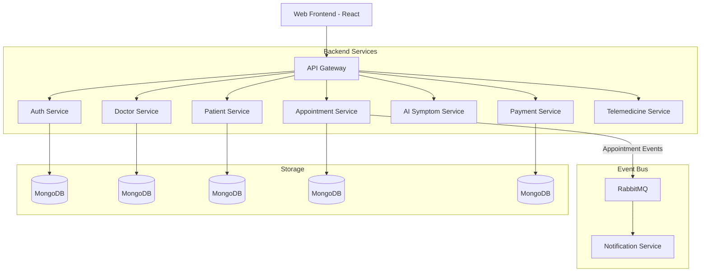

# 🏥 CareNet Healthcare Platform

[](https://microservices.io/)
[](https://reactjs.org/)
[](https://nodejs.org/)
[](https://www.docker.com/)

**CareNet** is a state-of-the-art, AI-enabled smart healthcare ecosystem. Designed with a modern microservices architecture, it provides a seamless experience for patients, doctors, and administrators to manage medical consultations, telemedicine sessions, and preliminary diagnoses.

---

## ✨ Key Features

### 🤖 AI-Powered Symptom Checker
Leverages advanced AI models (Gemini API) to analyze user-reported symptoms and provide preliminary healthcare guidance.

### 📅 Smart Appointment Management
Real-time scheduling system that allows patients to book slots based on doctor availability, with automatic conflict resolution.

### 🎥 Integrated Telemedicine
Built-in video consultation features powered by Jitsi/8x8, enabling remote healthcare services through a secure interface.

### 🛡️ Secure Auth & Verification
Role-based access control (RBAC) with JWT authentication. Includes a rigorous verification workflow for medical professionals to ensure trust.

### 💳 Modern Billing & Payments
Integrated payment gateway supporting secure transactions for consultations and services.

### 🔔 Event-Driven Notifications
Real-time alerts via Email and SMS powered by RabbitMQ, ensuring patients and doctors stay synchronized.

---

## 🏗️ System Architecture

The platform follows a distributed microservices pattern, ensuring high availability, scalability, and maintainability.



---

## 🛠️ Technology Stack

| Category | Technology |
| :--- | :--- |
| **Frontend** | React.js, Vite, Tailwind CSS, Framer Motion |
| **Backend** | Node.js, Express.js |
| **Database** | MongoDB (Mongoose), Supabase |
| **Messaging** | RabbitMQ (Message Broker) |
| **AI** | Google Gemini Generative AI |
| **Infrastructure** | Docker, Kubernetes (K8s), Minikube |
| **API Gateway** | Express Gateway |

---

## 📂 Microservices Overview

| Service | Responsibility |
| :--- | :--- |
| **Auth Service** | Identity management, JWT issuing, and profile access control. |
| **Doctor Service** | Doctor onboarding, profile management, and verification status. |
| **Patient Service** | Patient profile management and health record storage. |
| **Appointment Service** | Core business logic for scheduling, slots, and bookings. |
| **AI Symptom Service** | Analysis of symptoms using Large Language Models. |
| **Notification Service** | Sending Email/SMS alerts triggered by system events. |
| **Payment Service** | Processing and tracking financial transactions. |
| **Telemedicine Service** | Virtual room management and session tokens. |

---

## 🚦 Getting Started

### Prerequisites
- **Node.js**: v18 or higher
- **Docker Desktop**: For containerization
- **Minikube**: For Kubernetes local development
- **MongoDB**: (Or use Dockerized instances)
- **RabbitMQ**: (Or use Dockerized instance)

### ⚡ Automatic Setup (Windows)
We provide a comprehensive `start.bat` script that manages the entire lifecycle of the application:
1. Run `start.bat` from the root directory.
2. Select your environment:
   - **[1] Docker Compose**: Best for standard development.
   - **[2] Kubernetes**: Best for testing cloud-native scaling.

### 🐳 Manual Docker Launch
```bash
# Build and start all services
docker-compose up --build -d
```

| Component | URL | Credentials |
| :--- | :--- | :--- |
| **Frontend** | `http://localhost:5173` | UI Access |
| **API Gateway** | `http://localhost:8080` | Backend API |

---

## ⚙️ Environment Variables

Each microservice requires its own `.env` file. You can find templates in `.env.example` in the root directory. Key variables include:

```env
# Example AI Configuration
GEMINI_API_KEY=your_api_key_here

# Example Auth Configuration
JWT_SECRET=your_secure_secret_here

# RabbitMQ
RABBITMQ_URL=amqp://rabbitmq:5672
```

---

## ☸️ Kubernetes Deployment

To deploy to a Kubernetes cluster (e.g., Minikube):

```bash
# Apply deployments
kubectl apply -f k8s/deployments/

# Apply services
kubectl apply -f k8s/services/

# Check status
kubectl get pods
```

---

## 🛡️ License

This project is licensed under the **MIT License** - see the [LICENSE](LICENSE) file for details.

---

<p align="center">
  Built with ❤️ by the CareNet Team
</p>
