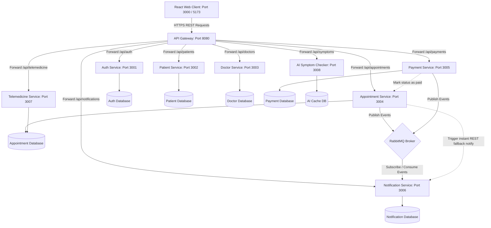
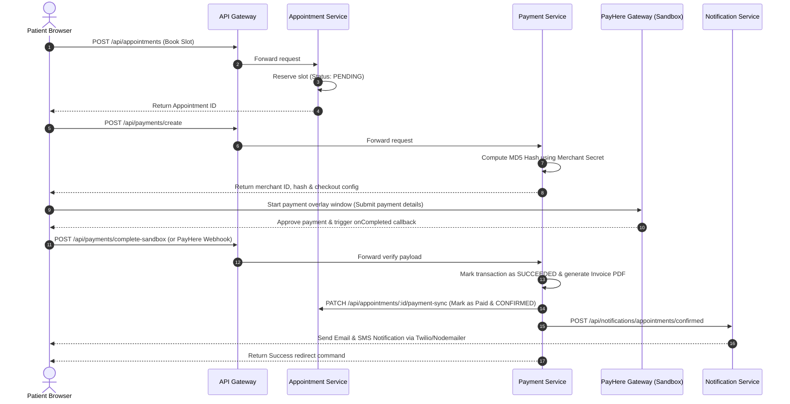

# CareNet — AI-Enabled Smart Healthcare Appointment & Telemedicine Platform
## Course: SE3020 – Distributed Systems (Assignment 1)
## SLIIT BSc (Hons) in IT Specializing in Software Engineering

---

## 1. High-Level Architectural Diagram

Below is the distributed systems architecture of CareNet. The frontend application runs asynchronously in the user's browser, proxying all external operations through the API Gateway, which handles unified routing and security before transferring calls to internal services over a secure container network.

### Architectural Highlights
- **Gateway Pattern:** The **API Gateway** acts as the single entry point. It intercepts all incoming requests, decodes/verifies the Bearer JWT token, and proxies the request to the corresponding internal microservice.
- **Database-per-Service:** Each microservice owns its MongoDB database instance (isolated schemas). No service is allowed direct access to another service's database, ensuring strong service boundaries.
- **Asynchronous Messaging:** RabbitMQ acts as the message broker. Low-priority, high-latency tasks like generating invoices, sending emails, or pushing SMS alerts are broadcast as events, consumed asynchronously by the Notification Service.
- **Sync Fallbacks:** Crucial updates (like marking an appointment as "Paid" once a sandbox transaction succeeds) use synchronous HTTP REST triggers to ensure atomic state updates.

---

## 2. Service Interfaces (Exposed APIs)

Each service exposes a set of RESTful endpoints. The interfaces are detailed below:

### 2.1 API Gateway Service
Exposes endpoints on Port `8080`, performing reverse-proxying:
- Routes `/api/auth/*` to Auth Service
- Routes `/api/patients/*` to Patient Service
- Routes `/api/doctors/*` to Doctor Service
- Routes `/api/appointments/*` to Appointment Service
- Routes `/api/payments/*` and `/api/refunds/*` to Payment Service
- Routes `/api/notifications/*` to Notification Service
- Routes `/api/telemedicine/*` to Telemedicine Service
- Routes `/api/symptoms/*` to AI Symptom Checker Service

---

### 2.2 Auth Service (Port 3001)
Exposes account operations and JWT tokens:
- **`POST /api/auth/register`**: Registers a user (Patient/Doctor/Admin).
- **`POST /api/auth/login`**: Verifies credentials and returns a signed JWT containing ID, Role, and Email.
- **`GET /api/auth/me`**: Decodes caller token and returns authenticated account data.

---

### 2.3 Patient Service (Port 3002)
Exposes medical history and profile management:
- **`GET /api/patients/:id`**: Retrieves profile details for a given patient.
- **`PUT /api/patients/:id`**: Updates patient phone, address, profile picture, or personal details.
- **`POST /api/patients/:id/reports`**: Uploads a medical record or diagnostic document (integrated with Supabase storage).
- **`GET /api/patients/:id/history`**: Retrieves list of previous medical appointments and logs.

---

### 2.4 Doctor Service (Port 3003)
Exposes schedules, digital prescriptions, and catalog lists:
- **`GET /api/doctors`**: Public query interface to search and filter doctors.
- **`GET /api/doctors/:id`**: Gets a doctor's public schedule and specialty info.
- **`PUT /api/doctors/:id`**: Allows doctors to edit biography, consultations fees, and profile image.
- **`POST /api/doctors/:id/availability`**: Allows doctors to create active date/time scheduling slots.
- **`POST /api/doctors/:id/prescriptions`**: Creates a digital prescription linked to an appointment ID.

---

### 2.5 Appointment Service (Port 3004)
Exposes core booking engines:
- **`POST /api/appointments`**: Reserves a doctor schedule slot (sets initial status to `PENDING`).
- **`GET /api/appointments/my`**: Lists patient bookings.
- **`GET /api/appointments/doctor`**: Lists appointments assigned to a doctor.
- **`PATCH /api/appointments/:id/status`**: Transitions appointment statuses (`PENDING` -> `CONFIRMED` -> `COMPLETED` / `CANCELLED`).
- **`DELETE /api/appointments/:id`**: Cancels an active booking request.

---

### 2.6 Payment Service (Port 3005)
Exposes gateways for Stripe and PayHere:
- **`POST /api/payments/create`**: Initiates transaction record in Database and computes secure PayHere sandbox hashes.
- **`POST /api/payments/complete-sandbox`**: Sandbox payment verification endpoint triggered on complete.
- **`POST /api/payments/payhere/notify`**: Webhook callback invoked by PayHere sandbox to securely finalize transactions.
- **`GET /api/payments/appointment/:appointmentId`**: Queries payment details associated with a booking.
- **`GET /api/payments/invoices/:transactionId`**: Generates and downloads invoice PDF.

---

### 2.7 Telemedicine Service (Port 3007)
Exposes instant video conferencing coordinates:
- **`POST /api/telemedicine/create-room`**: Generates room coordinates and issues room tokens using Jitsi Meet API.
- **`GET /api/telemedicine/join/:appointmentId`**: Resolves access controls and links to active rooms.

---

### 2.8 AI Symptom Checker Service (Port 3008)
Exposes preliminary diagnosis models:
- **`POST /api/symptoms/check`**: Feeds text inputs to the Gemini AI API, returning potential conditions and recommending medical specialties.

---

## 3. Workflows and Sequence Diagrams

### 3.1 User Authentication Workflow
1. Client submits credentials to `/api/auth/login`.
2. Auth Service checks MongoDB, hashes input with bcrypt, and verifies password.
3. Auth Service returns a signed JWT containing `{ userId, role, email }`.
4. Client stores the JWT in `localStorage` and appends it to all future headers as `Authorization: Bearer <token>`.

### 3.2 Appointment Booking & Payment Workflow
This workflow is a key sequence in the platform:

---

## 4. Security & Authentication Mechanisms

To protect sensitive health information and guarantee distributed isolation, the following mechanisms are adopted:

1. **JWT Auth Guards:** Tokens are signed using HMAC SHA256 with a unique `JWT_SECRET` key. When a user requests a protected resource, the request is intercepted by the Gateway, decoded, and matched with endpoint access criteria.
2. **Role-Based Access Control (RBAC):** Middleware checks specific fields inside the JWT payload:
   - `authorizeDoctor`: Rejects request if role != `DOCTOR`.
   - `authorizeAdmin`: Rejects request if role != `ADMIN`.
   - `authorizePatient`: Rejects request if role != `PATIENT`.
3. **Password Security:** Cleartext passwords are never stored. Passwords are encrypted on register using `bcryptjs` with a cost factor (salt rounds) of 10.
4. **Data Isolation:** Databases are segregated per microservice. The auth databases are strictly decoupled from patient clinical histories, preserving HIPAA/privacy principles.

---

## 5. Group Contributions Breakdown

| Student Name | Registration No. | SLIIT ID | Module Contribution |
|---|---|---|---|
| **Sandeep Gamage** | [Reg No 1] | [IT ID 1] | Created API Gateway, developed Auth Service, set up Docker Compose config, and deployed services to Kubernetes (Minikube). |
| **Member 2** | [Reg No 2] | [IT ID 2] | Implemented Patient Service, created profile pages, medical report upload (Supabase bucket integrations), and history tabs. |
| **Member 3** | [Reg No 3] | [IT ID 3] | Designed Doctor Service, schedule availability engines, developed digital prescription logic, and integrated Telemedicine (Jitsi Meet). |
| **Member 4** | [Reg No 4] | [IT ID 4] | Created Payment Service (PayHere & Stripe integrations), implemented Notification Service (Email + SMS), and AI Symptom Checker Service (Gemini API). |
